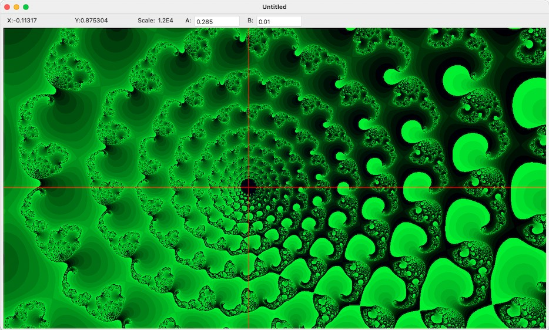

# JuliaSet
An Objective-C, OpenCL macOS app for exploring the JuliaSet

## Usage

* click to zoom in.
* click and drag to scroll.
* control-click to zoom out.

Some interesting values of a and b:

-1.553, 0.003

-0.765, 0.003

0.8 0.156

0.285, 0

0.285, 0.01

## Options
in -[JuliaDocument windowControllerDidLoadNib] you can set whether this uses NSOperation or OpenCL.

**Note:** ComputeRow.cl is not used. ComputeRow.clx is the actual OpenCL implementation.

After seeing a Nova documentary on fractals, Kitt and I researched the Julia set.

defined as iterating on z' = z^2+c where z is a complex number and c is a complex constant.

mapping z in 2 dimensions: z is x,iy.  (i is the sqrt of -1.) squaring that is (x^2 + (i^2)*y^2 + 2*i*x*y)

new_x = x^2 - y^2

new_y = 2*x*y

So our full julia set equation is:

new_x = x^2 - y^2 + a

new_y = 2*x*y + b

**Note:** Since OpenCL is automaticly translated to Metal, it uses `float`. The NSOperation version uses `double`.

## History

Originally written in 2010.

The OpenCL version is not the default because I've had trouble with it when the document window is very large.

Apache License.

